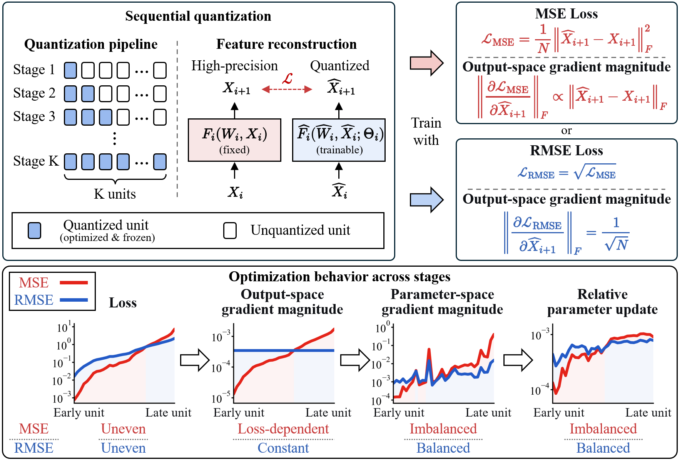

<h1 align="center">The Devil Is in the Reconstruction Loss Scale: Rethinking Optimization in LLM Quantization</h1>

  Chao Li · Shigeng Wang · Anbang Yao

  

Our work reveals and mitigates **Optimization Imbalance** in learning-based PTQ under sequential quantization:
- **Optimization Imbalance** arises because reconstruction loss magnitudes vary dramatically across quantization stages, and MSE translates these differences into highly uneven gradients and parameter updates.
- **RMSE** breaks this loss-dependent coupling through implicit gradient normalization, enabling more balanced optimization across stages.
- **[The technical report is now available on arXiv](https://arxiv.org/abs/2610.00983), and code and quantized model checkpoints will be released soon.**
